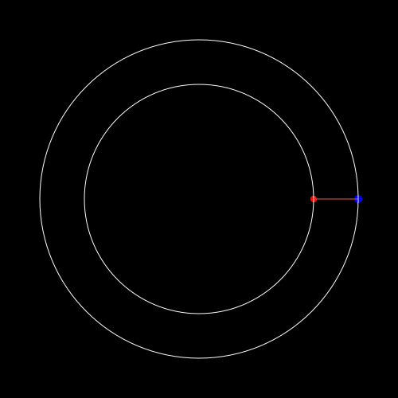
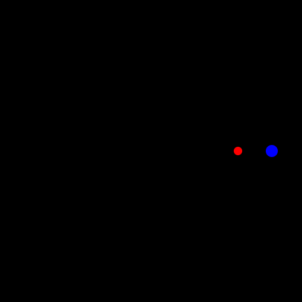
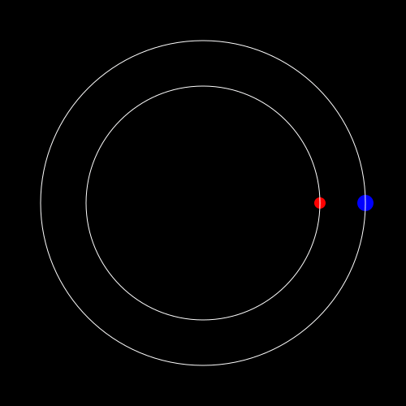
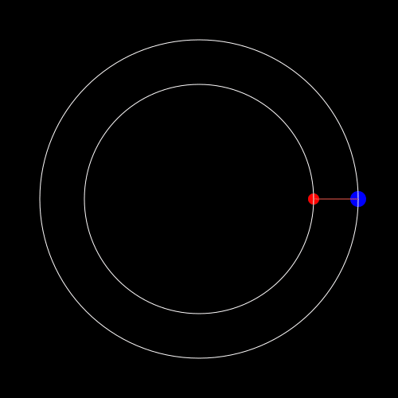

# **Tutorial 2:** Using Shorthands.

In the previous tutorial you must have come across something like:

`(args...) -> object(....)`

This is a declaration for an anonymous function that helps in the rendering process, but can be quite tricky to wrap someone's head around in the first few attempts. Also it can, at times, make the code abit complex to understand. Hence, to make things simpler for beginners, Javis has shorthand expressions.

By the end of this tutorial, you will have made the following animation that traces the relative path made by planets earth and venus while going around the sun(also known as the cosmic dance) which gives out a beautiful pattern!


# Learning Outcomes
This tutorial takes you through the functions/shorthand expressions for different objects like `circle`, `rect`, `line`, `ellipse`, `star` etc. that smooths out the learning curve for beginners to Javis. 

# The Space
Let's create a space in the infitnite cosmos where our planets will perform thier cosmic dance!
```julia
function ground(args...)
    background("black")
    sethue("white")
end
```

# Our planets
If you remember we created planets in the previous tutorial. We'll be doing something similar but using the Javis shorthands this time!

So rather than creating a `(args...) -> object(....)`, we will be using the Javis shorthand, viz. `JCircle`

`JCircle` is pretty flexible and takes in arguments similar to luxor's `circle()` function that we used in the previous tutorial, plus an extra argument `color`, so that you won't have to set the color manually.

```julia
myvideo = Video(500, 500)
function ground(args...)
    background("black")
    sethue("white")
end
Background(1:1000, ground)
frames =1000
earth = Object(1:frames,Javis.JCircle(O, 10, color="blue", action=:fill), Point(200, 0))

venus = Object(Javis.JCircle(O, 7, color="red", action=:fill), Point(144, 0))

render(
    myvideo;
    pathname="cosmic_dance.gif"
)
```


Now that we have created the planets, it would be also handly to map out thier independent orbits.

In the previous tutorial we used a `path!` function to create the orbits of the planets. This time we'll be using another Javis.jl shorthand `JShape` to trace out the orbits of the planets. 

`JShape` is a shothand macro that allows users to create complex objects with custom settings. All the parameters to be used inside the declaration eg: color, action etc. come after `@JShape` and at last comes the `begin...end` block that holds the declarations that makeup the object.   
```julia
myvideo = Video(500, 500)
function ground(args...)
    background("black")
    sethue("white")
end
frames =1000
Background(1:frames, ground)
earth = Object(1:frames,Javis.JCircle(O, 10, color="blue", action=:fill), Point(200, 0))
venus = Object(Javis.JCircle(O, 7, color="red", action=:fill), Point(144, 0))

earth_orbit = Object(Javis.@JShape color= "white" action=:stroke edge = "solid" begin
                        sethue(color)
                        setdash(edge)
                        circle(O, 200, action)
                    end)
    
venus_orbit = Object(Javis.@JShape color= "white" action=:stroke edge = "solid" begin
                    sethue(color)
                    setdash(edge)
                    circle(O, 144, action)
                end)

render(
    myvideo;
    pathname="cosmic_dance.gif"
)
```


# Planet motion
Let's give some motion to the planets.
```julia
myvideo = Video(500, 500)
function ground(args...)
    background("black")
    sethue("white")
end
frames =1000
Background(1:frames, ground)
earth = Object(1:frames, Javis. JCircle(O, 10, color="blue", action=:fill), Point(200, 0))
venus = Object(1:frames, Javis.JCircle(O, 7, color="red", action=:fill), Point(144, 0))

earth_orbit = Object(1:frames, Javis.@JShape color= "white" action=:stroke edge = "solid" begin
                        sethue(color)
                        setdash(edge)
                        circle(O, 200, action)
                    end)
    
venus_orbit = Object(1:frames, Javis.@JShape color= "white" action=:stroke edge = "solid" begin
                    sethue(color)
                    setdash(edge)
                    circle(O, 144, action)
                end)

# We need the planets to revolve according to their time periods.
# Earth completes its one revolution in 365 days and Venus does that in 224.7 days.
# Hence, we need to multiply (224.7/365) so that the time period matches properly i.e.,
# when earth completes its full revolution, Venus has done (224.7/365) th of its revolution.
act!(earth, Action(anim_rotate_around(12.5 * 2π, O)))
act!(venus, Action(anim_rotate_around(12.5 * 2π * (224.7 / 365), O)))

render(
    myvideo;
    pathname="cosmic_dance_revolution.gif"
)
```


# Tracing out the relative path

Let's trace out the relative path that earth and venus follow!
```julia
myvideo = Video(500, 500)
function ground(args...)
    background("black")
    sethue("white")
end
frames =1000
Background(1:frames, ground)
earth = Object(1:frames, Javis. JCircle(O, 10, color="blue", action=:fill), Point(200, 0))
venus = Object(1:frames, Javis.JCircle(O, 7, color="red", action=:fill), Point(144, 0))

earth_orbit = Object(1:frames, Javis.@JShape color= "white" action=:stroke edge = "solid" begin
                        sethue(color)
                        setdash(edge)
                        circle(O, 200, action)
                    end)
    
venus_orbit = Object(1:frames, Javis.@JShape color= "white" action=:stroke edge = "solid" begin
                    sethue(color)
                    setdash(edge)
                    circle(O, 144, action)
                end)

# We need the planets to revolve according to their time periods.
# Earth completes its one revolution in 365 days and Venus does that in 224.7 days.
# Hence, we need to multiply (224.7/365) so that the time period matches properly i.e.,
# when earth completes its full revolution, Venus has done (224.7/365) th of its revolution.
act!(earth, Action(anim_rotate_around(12.5 * 2π, O)))
act!(venus, Action(anim_rotate_around(12.5 * 2π * (224.7 / 365), O)))

# to store the connectors
connection = []
Object(1:frames, (args...) -> connector!(connection, pos(earth), pos(venus), "#f05a4f"))

render(
    myvideo;
    pathname="cosmic_dance_path.gif"
)
```


Beauty!
Go ahead and post this on your social handle! And don't forget to use the hastag `#javis`.

# Conclusion
Shorthands don't end here!
Javis currently has 8 shorthand expressions to make the process of creating animations simpler.
Eg:
```julia
myvideo = Video(500, 500)
function ground(args...)
    background("black")
    sethue("white")
end
frames =1
Background(1:frames, ground)
# Line
Object(1:frames, Javis.JLine(Point(100, -250), color="yellow"))
# Box
Object(Javis.JBox(Point(-200, -200), Point(200, 200), color="white", action=:stroke))
# Rect
Object(Javis.JRect(175, 15, 30, 55, color="white", action=:fill))
# Ellipse
Object(Javis.JEllipse(-50, 25, 45, 25, color="yellow", action=:fill))
# Star
Object(Javis.JStar(0, 120, 45, color="orange", action=:fill))
# Polygon
Object(Javis.JPoly(ngon(O, 150, 3, -π/2, vertices=true), color="yellow"))
render(
    myvideo;
    pathname="shorthand_examples.gif"
)
```


> **Author(s):** Arsh Sharma, Ved Mahajan \
> **Date:** July 7th, 2021 \
> **Tag(s):** shorthands, object, action, rotation

