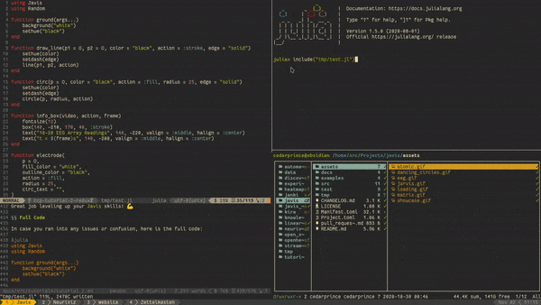
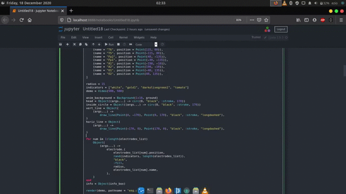
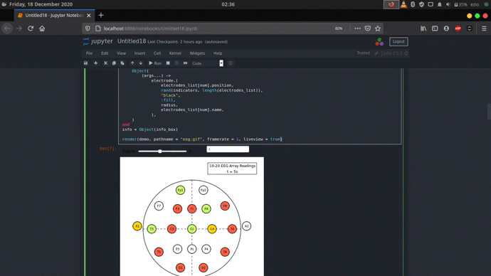
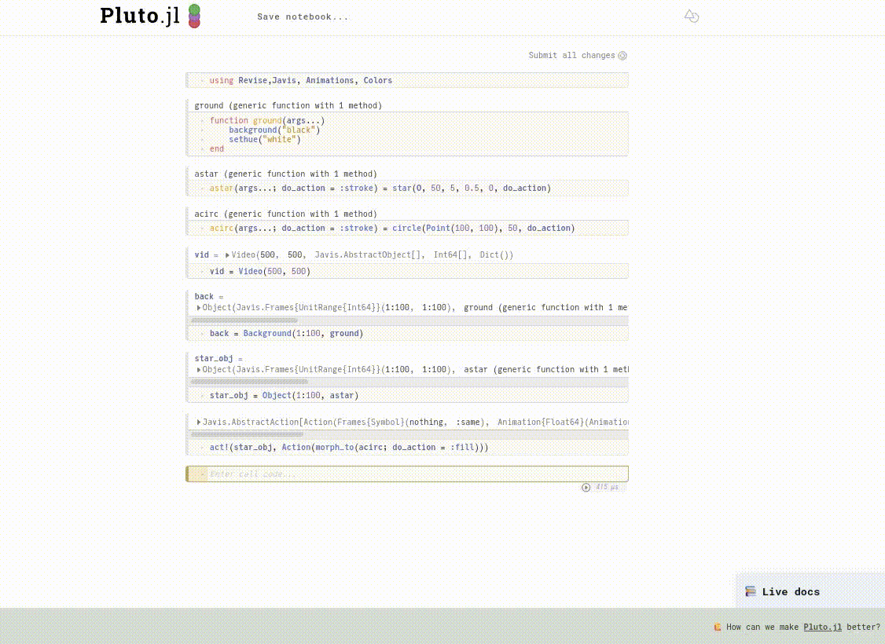
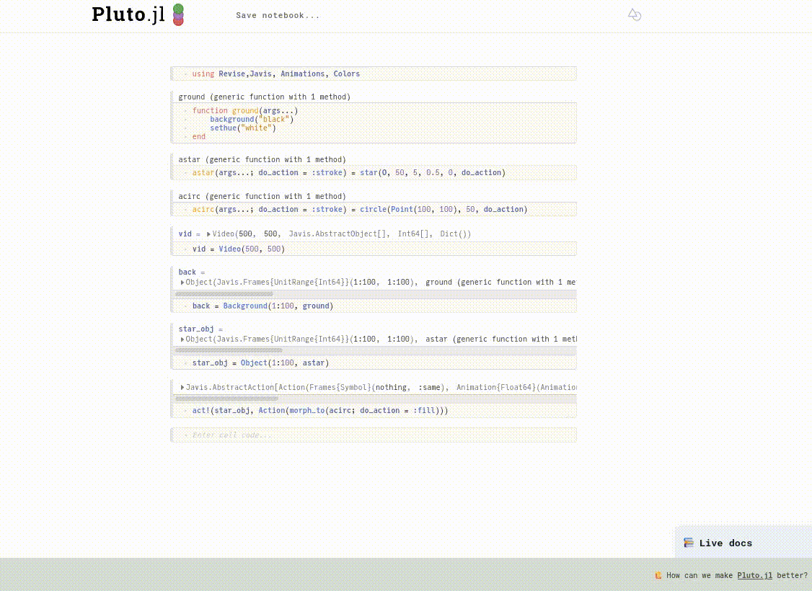

# Workflows for `Javis` Animation Development

`Javis` provides an easy way to create performant visualizations.
However, sometimes building these animations can be a difficult process with having to keep track of one's code, particular frames, and previewing your graphic.
This section is dedicated to workflows one can use for making `Javis` animations.

## Previewing Animations Using the Javis Live Viewer

Supported Platforms: Windows*, OSX, Linux

> NOTE: Windows users may experience a slow-down with the Javis Live Viewer. 
> This is because the viewer is built on top of GTK which is not immensely performant on Windows machines.
> If the viewer is does not perform well on Windows for you, we encourage you to try out one of the other workflows.

Javis provides a built-in viewer called the "Javis Live Viewer" which allows one to preview animated graphics without having to save the animation to a file.
This works by the viewer calculating each individual frame for an animation as it is called.
The viewer can be activated for any animation one renders by doing this:

```julia
...
render(video, liveview = true)
```

Setting `liveview` to true in the `render` function causes the Viewer to appear in a separate window.
Here is an example of how that looks altogether:



Sometimes the Viewer can be slow on some computers if it is handling a large animation or a frame performing complicated actions with many objects.
If this is the case, currently, the best way to handle this is to fully render the animation and save it to a file for previewing.
In the future, we will add a caching feature for the Viewer such that all frames are pre-rendered for the Viewer so one can quickly view each frame.

## Workflow for Jupyter Notebooks

Javis now supports a minimal version of the Javis viewer using the [Interact.jl](https://github.com/JuliaGizmos/Interact.jl) package. It automatically detects the `IJulia`(Jupyter Notebook environment).
Here's what it looks like with the `liveviewer` flag set to `true` :



> NOTE: For animations involving heavy computation this may be a bit laggy.

### Common Problems:
- WebIO error (WebIO is not installed)
    
    The comment in discussion [here](https://github.com/Wikunia/Javis.jl/pull/288#issuecomment-747671260) should help out with the problem.

- No change on dragging the silder/changing the value in textbox

    Try restarting the kernel. This might problably be an error with the WebIO integration.


To make the Jupyter Notebook experience with Javis more easy, videos rendered as gifs via setting the `liveview` flag as `false`, are directly viewed as `MIME` elements in the notebook as seen below: 



## Workflow for Pluto Notebooks
The workflow for Pluto notebooks is almost similar to the one for Jupyter Notebook.
To be able to use the interactivity, you'll have to manually import the `PlutoUI` pacakge and use the `@bind` macro.

eg:
```julia
...
# to be typed in different cells
using PlutoUI

anim = render(video, liveview = true)
```

The statements below should be entered into two different cells (without any `begin`-`end` block)
```julia
# frames: number of frames
@bind x Slider(1:1:frames)

anim[x]
``` 



If you don't want to use the interactivity and simply display the output, set the `liveviewer` flag as `false` and Pluto will display the gif.



One can refer to the sample file [here](assets/javis-pluto.jl)
